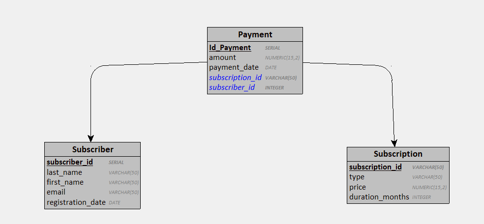
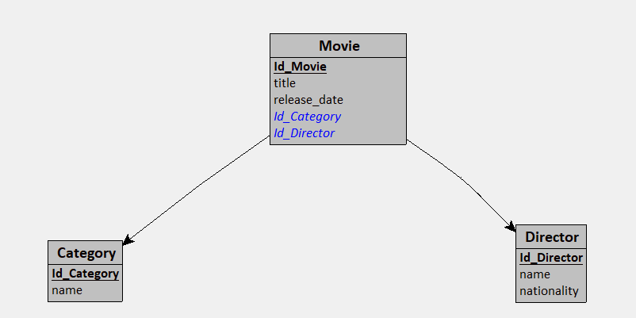

# 📚 NetCole IT Flix - Microservices Exam Starter Repository

## 🚀 Objectif du projet
Ce projet est une base pour l'évaluation finale des apprenants. Il s'inscrit dans une mise en situation professionnelle :

> Vous êtes embauché(e) par **NetCole IT Flix**, une startup spécialisée dans le streaming de films et séries.
> Votre mission est de concevoir une **architecture microservices** incluant deux services principaux, une **API Gateway** et un **Eureka Server** pour la découverte de services.

## 🔧 Architecture conseillée
```
microservices-netcole-flix
├── subscriber-service
├── movie-service
├── gateway-service
├── eureka-server
├── docker-compose.yml
├── README.md

```

## 📝 Description des microservices

### 1. 📅 `subscriber-service`
Gère les abonnés, leurs abonnements et paiements associés.



#### Tables concernées (3NF)
```sql
CREATE TABLE Subscriber(
   subscriber_id SERIAL,
   last_name VARCHAR(50),
   first_name VARCHAR(50),
   email VARCHAR(50),
   registration_date DATE,
   PRIMARY KEY(subscriber_id)
);

CREATE TABLE Subscription(
   subscription_id SERIAL,
   type VARCHAR(50),
   price NUMERIC(15,2),
   duration_months INTEGER,
   PRIMARY KEY(subscription_id)
);

CREATE TABLE Payment(
   Id_Payment SERIAL,
   amount NUMERIC(15,2),
   payment_date DATE,
   subscription_id INTEGER NOT NULL,
   subscriber_id INTEGER NOT NULL,
   PRIMARY KEY(Id_Payment),
   FOREIGN KEY(subscription_id) REFERENCES Subscription(subscription_id),
   FOREIGN KEY(subscriber_id) REFERENCES Subscriber(subscriber_id)
);
```

### 2. 🎬 `movie-service`
Permet la gestion des films avec leurs catégories et réalisateurs.


#### Tables concernées (3NF)
```sql
CREATE TABLE Category(
   Id_Category SERIAL,
   name VARCHAR(50),
   PRIMARY KEY(Id_Category)
);

CREATE TABLE Director(
   Id_Director SERIAL,
   name VARCHAR(50),
   nationality VARCHAR(50),
   PRIMARY KEY(Id_Director)
);

CREATE TABLE Movie(
   Id_Movie SERIAL,
   title VARCHAR(50),
   release_date DATE,
   Id_Category INTEGER NOT NULL,
   Id_Director INTEGER NOT NULL,
   PRIMARY KEY(Id_Movie),
   FOREIGN KEY(Id_Category) REFERENCES Category(Id_Category),
   FOREIGN KEY(Id_Director) REFERENCES Director(Id_Director)
);
```

## 📆 À vous de jouer !
Créez chaque microservice avec Spring Boot et les dépendances nécessaires :
- Spring Web, Spring Data JPA, PostgreSQL Driver
- Eureka Discovery Client, Actuator, Devtools
- Pour la gateway : Spring Cloud Gateway + Eureka Discovery Client
- Pour Eureka Server : Spring Cloud Netflix Eureka Server

Bonne chance ✨

